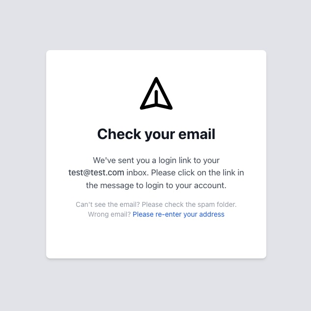
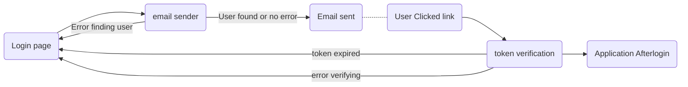

# Maildoor


Maildoor is an email based authentication library for Go (lang), powered by Go `embed` package, JWT's and TailwindCSS. Maildoor provides simple and beautiful user interface that is easy to use and customize with your logo.

<div style="padding: 20px; text-align: center;">
    
    
</div>

But the UI is not all, Maildoor ships as a Go handler that contains the needed endpoints to login users by emailing tokens to their email addresses instead of using passwords. Maildoor allows to define application specific behaviors as part of the authentication process.


## Installation

This library is intended to be used as a dependency in your Go project. Installation implies go-getting the package with:

```sh
go get github.com/wawandco/maildoor@latest
```

And then using it accordingly in your app. See the Usage section for detailed instructions on usage.
## Usage

Maildoor instances satisfy the http.Handler interface and can be mounted into Mupliplexers. To initialize a Maildoor instance, use the New function:

```go
	// Initialize the maildoor handler to take care of the web requests.
	auth, err := maildoor.NewWithOptions(
		os.Getenv("SECRET_KEY"),

		maildoor.UseFinder(finder),
		maildoor.UseAfterLogin(afterLogin),
		maildoor.UseLogout(logout),
		maildoor.UseTokenManager(maildoor.DefaultTokenManager(os.Getenv("SECRET_KEY"))),
		maildoor.UseSender(
			maildoor.NewSMTPSender(maildoor.SMTPOptions{
				From:     os.Getenv("SMTP_FROM_EMAIL"),
				Host:     os.Getenv("SMTP_HOST"), // p.e. "smtp.gmail.com",
				Port:     os.Getenv("SMTP_PORT"), //"587",
				Password: os.Getenv("SMTP_PASSWORD"),
			}),
		),
	)

    if err != nil {
        return nil, fmt.Errorf("error initializing maildoor: %w", err)
    }
```

After initializing the Maildoor instance, you can mount it into a multiplexer:

```go
mux := http.NewServeMux()
mux.Handle("/auth/", auth) // Set the prefix

fmt.Println("Listening on port 8080")
if err := http.ListenAndServe(":8080", server); err != nil {
	panic(fmt.Errorf("error starting server: %w", err))
}
```
### Options

After seeing how to initialize the Maildoor Instance, lets dig a deeper into what some of these options mean.

#### FinderFn

The finder function is used to find a user by email address. The logic for looking up users is up to the application developer, but it should return an `Emailable` instance to be used on the signin flow. The signature of the finder function is:

```go
func(string) (Emailable, error)
```

Where the string is the email address or token to identify the user.
#### SenderFn

Maildoor does not take care of sending your emails, instead it expects you to provide a function that will do this. This function will be called when a user requests a token to be sent to their email address and will be passed the message that needs to be send to the user.

The sender function signature is:

```go
func(*maildoor.Message) error
```

When this function returns an error the sign-in flow redirects the user to the login page with an error message.

#### AfterLoginFn

AfterLoginFn is a function that is called after a user has successfully logged in. It is passed the request instance, the response and user that has just logged in. Within this function typically the application does things like setting a session cookie and redirecting the user to a secure page. As with the sender function, its up to the application to decide what happens within the afterLogin function. 

Its signature is:

```go
func(http.ResponseWriter, *http.Request, Emailable) error
```

#### LogoutFn

Similar than the afterLogin function, the logout function is called after a user has successfully logged out. It is passed the request instance, the response and user that has just logged out. Within this function typically the application does things like clearing the session cookie and redirecting the landing page. As with the afterLoginFn function, it's up to the application to decide what happens within the logout function.

Its signature is:

```go
func(http.ResponseWriter, *http.Request) error
```

#### BaseURL

The baseURL is the base URL where the app is running. By default its `http://localhost:8080` but you can override this value by setting the BaseURL option. 

#### Prefix

Prefix of the maildoor routes, by default it is `/auth`. You can override this value by setting the Prefix option. When using a multiplexer, make sure to set the prefix to the same value as the one used in the maildoor instance.

```go

auth, err := maildoor.New(maildoor.Options{
...
    Prefix: "/auth",
...
})

mux.Handle("/auth/", auth) // Correct
mux.Handle("/other/", auth) // Incorrect
```

#### Product

Product allows to set some product related settings for the signin flow. This helps branding the pages rendered to the user. The product can specify the name of the product, the logo and the favicon.

#### TokenManager

TokenManager is a very important part of the authentication process. It is responsible for generating and validating tokens across the email authentication process. Maildoor provides a default implementation which uses JWT tokens, whether the application uses JWT or not, it should provide a token manager. A token manager should meet the TokenManager interface.

```go
type TokenManager interface {
    Generate(Emailable) (string, error)
    Validate(string) (string, error)
}
```

To use the default token manager, you can use your key to build it:

```go
maildoor.DefaultTokenManager(os.Getenv("TOKEN_MANAGER_SECRET"))
```

#### CSRFTokenSecret

This option sets the secret used by the signin form to protect against CSRF attacks. We recommend to pull this value from an environment variable or secret storage.
#### Logger
Logger option allows application to set your own logger. If this is not specified Maildoor will use a muteLogger, which will not print anything out. There is a BasicLogger that can be used if needed. Also, if there is the need for a custom logger you can implement the Logger interface.

```go
// Logger interface defines the minimum set of methods
// that a logger should satisfy to be used by the library.
type Logger interface {
	// Log a message at the Info level.
	Info(args ...interface{})

	// Log a formatted message at the Info level.
	Infof(format string, args ...interface{})

	// Log a message at the Error level.
	Error(args ...interface{})

	// Log a formatted message at the Error level.
	Errorf(format string, args ...interface{})
}
```

### Login Workflow

The following chart shows the authentication process flow followed by the Maildoor library.



### The HTTP Endpoints

Maildoor is an http.Handler, which means it receives requests and responds to them. The Maildoor handler is mounted on a prefix, which is set by the application developer. Under that prefix the handler responds to the following endpoints:

#### GET:/auth/login
This is the login form. It renders a form with a CSRF token and a submit button. In here the user is asked to enter their email address.

#### POST:/auth/send
This endpoint is hit by the login form. It receives the email address and the CSRF token from the user and upon confirmation with the `FinderFn` it sends a link with token to the user's email address.
#### GET:/auth/validate
This endpoint is where the email link is validated. It receives the token from the URL and it validates the token. If the token is valid, it runs the `AfterLoginFn` function.
#### DELETE:/auth/logout
This endpoint is intended to be used by the app to logout the user. It just run the `LogoutFn` function.

#### GET:/assets/*
This endpoint serves static assets. It is mounted on the `/assets` prefix and it will serve all files from the `/assets` directory such as images and css needed for the form.


### Sample Application

Within the sample folder you can find a go application that illustrates the usage of Maildoor. To run it from the command line you can use:

```sh
go run ./sample/cmd/sample
```
## FAQ

I do not use SMTP for sending, what should I do?
> Each application is free to send emails as it desires, in the sample application we use a [sendgrid](https://sendgrid.com/) SMTP authentication sender.

How to I customize the email logo and product?
> These can be customized by setting the `Logo` and `Favicon` in the Product settings.

Can I change the email copy (Subject or content)?
> Yes, you can change the subject and the content of the email. Maildoor will provide a Message struct that to your application implementation of the SenderFn, within there you can decide to change the subject and the content of the email.

I don't want to use JWT for my tokens, what should I do?
> As long as you provide a TokenManager, Maildoor will use the token manager to generate and validate tokens.

What should I do in the `AfterLoginFn` hook?
> Typically session and cookie management after login, but other things such as logging and threat detection can be done in there.

How do I secure my application to prevent unauthorized access?
> Typically you would have a middleware that secures your private routes. Maildoor does not provide such middleware but it typically checks a session either in cookies or other persistence mean.

## Guiding Principles

- Use standard Go library as much as possible to avoid external dependencies.
- Application logic should live in the application, not in the library.
## TODO

- [x] Add: Login flow diagram
- [x] Build: Default SMTPSender
- [x] Optimize: CSS to only be the one used (Tailwind CSS can do this)
- [x] Add: Login/sent screenshots
- [x] Add: Default afterLogin and logout hook functions (Cookie based)
- [ ] Add: Secure cookie for the default afterLogin hook function.
- [ ] Research: flash error messages instead of using parameters
- [ ] Add: Error pages (500 and 404)
- [ ] Design: Authentication Middleware ❓
- [ ] Design: Custom messages 
- [ ] Design: Custom templates.


